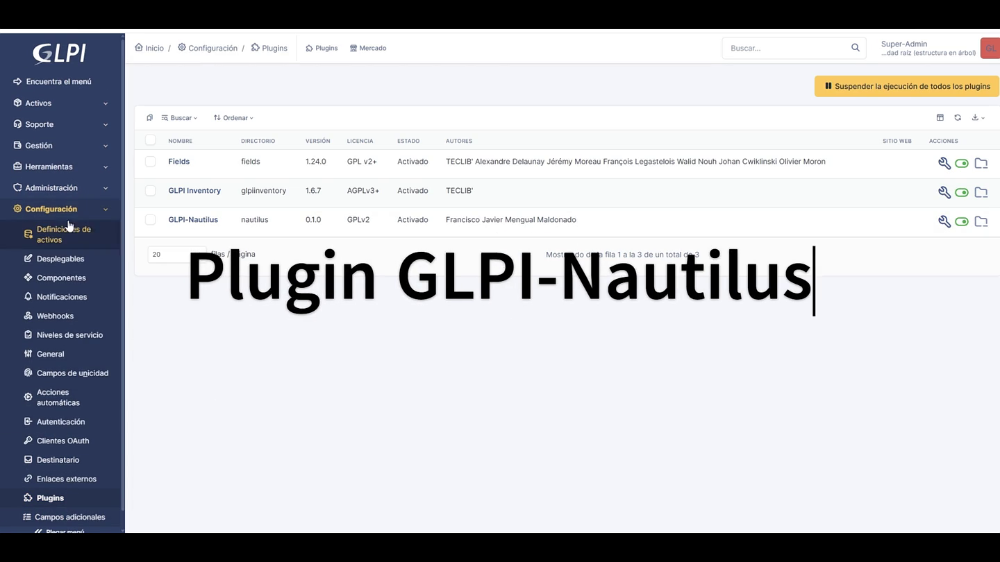
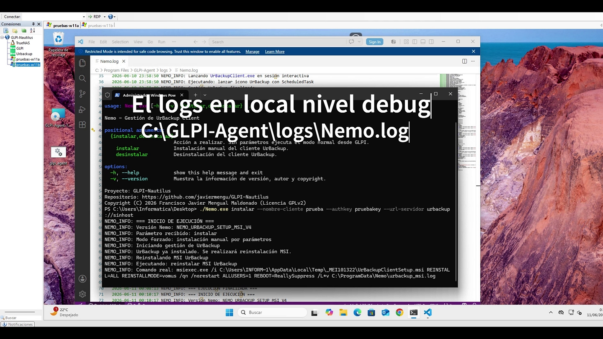

# GLPI-Nautilus

GLPI-Nautilus es una solución basada en software libre para centralizar la gestión de copias de seguridad de equipos inventariados en GLPI.

El proyecto integra GLPI, UrBackup, GLPI Inventory y un componente cliente llamado Nemo. Su finalidad es disponer de un punto de control único desde GLPI para decidir qué equipos deben tener copia de seguridad activa, automatizar la instalación o retirada del cliente UrBackup y sincronizar información relevante del estado de las copias.

La solución se ha diseñado en el marco de un **Trabajo Fin de Grado en Ingeniería Informática de UNIR**, con un enfoque orientado a administración de sistemas, desarrollo de software e integración de servicios mediante API.

---

## Componentes del proyecto

El repositorio se organiza en dos componentes principales:

```text
GLPI-Nautilus/
├── nautilus/
│   └── Plugin para GLPI
└── nemo/
    └── Cliente ejecutable para Windows
```

### Nautilus

Nautilus es un plugin para GLPI 11.

Su función es actuar como punto de control centralizado dentro de GLPI.

Permite:

- Añadir campos asociados a la copias de seguridad en la ficha de los equipos.
- Almacenar el estado deseado de backup.
- Sincronizar la fecha del último backup desde UrBackup.
- Limpiar clientes de UrBackup que ya no deben mantenerse.

### Nemo

Nemo es un ejecutable para Windows.

Su función es actuar localmente en el equipo final.

Permite:

- Consultar GLPI mediante API REST.
- Consultar Urbackup.
- Identificar el equipo inventariado.
- Leer el estado de backup definido por Nautilus.
- Instalar o desinstalar UrBackup Client según corresponda.
- Integrarse con GLPI Inventory para su despliegue.

---

## Demostración del Proyecto

Pulse clic en la imagen para ver el video de demostración de las funcionalidades del plugin:


[](https://youtu.be/ML2TaBR1Qbs)

Pulse clic en la imagen para ver el video de demostración de nemo lanzado en local:

[](https://youtu.be/_j9I_fNGEfk)

---

## Objetivo general

El objetivo general del proyecto es disponer de una solución que permita centralizar la gestión y monitorización de copias de seguridad asociadas a activos TIC inventariados.

La solución busca reducir la gestión manual y fragmentada entre herramientas independientes, manteniendo GLPI como punto principal de control.

---

## Arquitectura general

La arquitectura se basa en la separación entre decisión y ejecución.

```text
GLPI
  ├── Inventario de activos
  ├── Plugin Nautilus
  ├── Campos de backup
  └── GLPI Inventory

UrBackup
  └── Servidor de copias

Equipo Windows
  ├── GLPI Agent
  ├── Nemo
  └── UrBackup Agent
```

GLPI almacena la decisión administrativa.

Nemo aplica esa decisión en el equipo final.

UrBackup realiza y gestiona las copias de seguridad.

---

## Flujo funcional

El flujo general de funcionamiento es:

```text
1. GLPI mediante GLPI Agent obtiene el inventario del equipo.
2. El Administrador activa o desactiva el backup en GLPI.
3. Nautilus almacena el valor en el campo estado_backup.
4. GLPI Inventory despliega o ejecuta Nemo en el equipo final.
5. Nemo consulta GLPI y lee estado_backup.
6. Nemo comprueba el estado del cliente en UrBackup.
7. Nemo instala, mantiene o desinstala UrBackup Client.
8. UrBackup realiza las copias.
9. Nautilus sincroniza la fecha del último backup en GLPI.
```

---

## Identificación entre GLPI y UrBackup

La solución utiliza el identificador interno del equipo en GLPI como nombre del cliente en UrBackup.

Ejemplo:

```text
Equipo GLPI ID: 153
Cliente UrBackup: 153
```

Esta decisión evita depender del nombre del equipo, que puede cambiar durante su ciclo de vida.

Ventajas:

- Relación directa entre activo GLPI y cliente UrBackup.
- Reducción de duplicados.
- Mayor estabilidad ante cambios de nombre.
- Lógica de integración más sencilla.

---

## Requisitos generales

Requisitos principales:

```text
GLPI >= 11.0
Plugin Fields activo
Plugin GLPI Inventory activo
GLPI Agent en los equipos finales
Servidor UrBackup accesible
Equipos Windows para ejecución de Nemo
Permisos administrativos para instalación del agente UrBackup
```

En despliegues con contenedores, se recomienda usar almacenamiento persistente para GLPI, plugins y datos de UrBackup.

---

## Estructura del repositorio

Estructura:

```text
GLPI-Nautilus/
├── README.md
├── LICENSE
└── assets/
    ├── demo_nautilus.mp4
    └── demo_demo.mp4
├── nautilus/
│   ├── README.md
│   ├── setup.php
│   ├── hook.php
│   ├── front/
│   └── inc/
└── nemo/
    ├── README.md
    ├── nemo.py
    ├── glpi.py
    ├── urbackup.py
    ├── config_nemo.py
    ├── generar_config_ofuscada.py
    ├── config_example.ini
    └── nemo.spec
```

El fichero `README.md` de la raíz ofrece una visión general.

Los ficheros `nautilus/README.md` y `nemo/README.md` documentan cada componente de forma específica.

---

## Despliegue general

El despliegue completo se divide en varias fases:

```text
1. Preparar la infraestructura base.
2. Desplegar GLPI.
3. Desplegar UrBackup.
4. Instalar GLPI Inventory.
5. Instalar el plugin Nautilus.
6. Configurar la conexión con UrBackup.
7. Compilar Nemo.
8. Crear el paquete Nemo en GLPI Inventory.
9. Ejecutar el ciclo de prueba completo.
```

---

## Despliegue en Docker y TrueNAS

En entornos Docker se recomienda evitar enlaces simbólicos creados manualmente dentro del contenedor.

La opción recomendada es montar las rutas persistentes directamente:

```text
/mnt/pool-backups/glpi_data     -> /var/glpi
/mnt/pool-backups/glpi/plugins  -> /var/www/glpi/plugins
/mnt/pool-backups/glpi_data/nemo -> /var/glpi/files/_plugins/glpiinventory/upload
```

De esta forma, el plugin Nautilus queda disponible en:

```text
/var/www/glpi/plugins/nautilus
```

Y los datos principales sobreviven a reinicios, recreaciones o actualizaciones del contenedor.

Montar el directorio nemo (previamente creado) se utiliza para facilitar copiar el distribuible Nemo generado mediante SSH.

---

## Instrucciones y Operativa

### Incidencia con UrBackup: Reutilización del nombre de cliente

Existe un documento en este repositorio, `incidencia_urbackup.md`, que describe en detalle un problema detectado en la integración con UrBackup. 

El problema se presenta cuando se elimina un cliente del servidor, se realiza una limpieza local completa y, posteriormente, se vuelve a instalar el agente reutilizando el mismo nombre de cliente. En este escenario, el equipo no logra conectar con el servidor hasta que se reinicia el contenedor de UrBackup. Para conocer el diagnóstico completo y la medida correctiva aplicada, consulta dicho documento.

---

### Ayuda para el despliegue del GLPI Agent

Para automatizar la instalación del agente de GLPI en los equipos finales con Windows, se puede generar un archivo por lotes (`.bat`). Este script realiza una instalación silenciosa, añade la excepción al firewall, configura el servicio de Windows y establece los permisos de red necesarios para las tareas de inventario y despliegue.
Antes de ejecutar el script, asegúrate de descargar el instalador del agente. Puedes obtener la versión 1.7.1 (64 bits) directamente desde el repositorio oficial de GLPI:
[Descargar GLPI-Agent-1.7.1-x64.msi](https://github.com/glpi-project/glpi-agent/releases/download/1.7.1/GLPI-Agent-1.7.1-x64.msi)

Crea un archivo llamado `glpi_agent.bat` y copia el siguiente bloque completo en su interior:

```bat
@echo off
:: 1. Instalación del agente
:: Sustituye glpi.dominio por la dirección real de tu servidor GLPI
:: Sustituye /qb por /qn si la instalación es silenciosa
:: Sustituye x.x.x.0/24 por la red que deseas que atienda 
echo Instalando GLPI-Agent...
msiexec /i "GLPI-Agent-1.7.1-x64.msi" /qb /norestart SERVER="[http://glpi.eez.csic.es/marketplace/glpiinventory/](http://glpi.eez.csic.es/marketplace/glpiinventory/)" RUNNOW=1 ADD_FIREWALL_EXCEPTION=1  ADD_WINDOWS_SERVICE=1 ADDLOCAL=ALL TASKS="Inventory,Deploy" DELAYTIME=60 HTTPD_TRUST="x.x.x.x/24,x.x.x.x/24,127.0.0.1/32"

echo Instalacion finalizada correctamente.
pause
```

---

## Tareas automáticas

La solución utiliza tareas automáticas en GLPI y tareas internas de UrBackup.

Tareas principales de Nautilus:

```text
urbackup_clean
urbackup_sync
```

### urbackup_clean

Revisa los clientes existentes en UrBackup y marca para eliminación aquellos que no deben mantenerse.

### urbackup_sync

Consulta UrBackup y sincroniza en GLPI la fecha del último backup conocido.

---

## Planificación en producción

En producción se recomienda ejecutar las tareas de forma ordenada con el siguiente horario:

```text
01:00 - 03:00  -> urbackup_clean
03:00 - 07:00  -> ventana de limpieza interna configurada en Urbackup.
10:00 - 14:00  -> urbackup_sync
```

Durante pruebas puede utilizarse una frecuencia mayor para validar el ciclo completo sin esperar a los procesos diferidos de UrBackup.

---

## Despliegue mediante GLPI Inventory

Nemo se distribuye mediante el módulo de despliegue de GLPI Inventory.

Configuración recomendada del paquete:

```text
Paquete: Nemo
Fichero: Nemo.exe
Etiqueta de la acción: Lanzar Nemo
Líneas de salida a recuperar: 100
Validación: código de retorno igual a 0
```

La acción será:

```cmd
powershell.exe -NoProfile -ExecutionPolicy Bypass -Command ^
"$p = Start-Process '.\Nemo.exe'-PassThru -RedirectStandardOutput nemo_out.log -RedirectStandardError nemo_err.log; ^
if (-not ($p.WaitForExit(300000))) { ^
    taskkill /F /T /PID $p.Id; ^
    Write-Output 'NEMO_ERROR: Timeout global de 5 minutos'; ^
    exit 1 ^
}; ^
if (Test-Path nemo_out.log) { Get-Content nemo_out.log }; ^
if (Test-Path nemo_err.log) { Get-Content nemo_err.log }; ^
exit $p.ExitCode"
```

Esto facilita revisar mensajes de ejecución desde GLPI Inventory.

---

## Configuración de la tarea de despliegue

```text
Tarea: Despliegue Nemo
Destino/Paquete: Nemo
Actores: grupo de inventario Nautilus Todos los ordenadores
Número de agentes a activar: 25
Intervalo de activación del agente: 300 minutos (5 horas)
Permit to re-prepare task after run: activo
```

Esta configuración evita una ejecución masiva y reduce la carga sobre GLPI, UrBackup y la red.

---

## Seguridad

La solución se ha diseñado con el principio de mínimo privilegio.

Recomendaciones:

- Usar usuarios técnicos específicos, no usar cuentas genéricas.
- No utilizar credenciales personales para los usuarios alta en Urbackup o Nemo en GLPI.
- Limitar permisos en GLPI y UrBackup.
- Proteger el acceso a la configuración.
- No publicar credenciales en el repositorio.
- No exponer GLPI ni UrBackup directamente a Internet sin uso de VPN.
- Validar el despliegue primero en un grupo reducido.
- Revisar logs de GLPI, Nautilus, Nemo y UrBackup.
- Dehabilitar acceso directo al servidor TrueNAS, provisionalmente habilitado con fines de configuración.

Nemo puede utilizar ofuscación básica para evitar que credenciales sensibles aparezcan en texto claro en el fichero de configuración distribuido. Esta ofuscación no sustituye a una correcta política de permisos.

---

## Relación con el Esquema Nacional de Seguridad (ENS)

El proyecto se plantea como una ayuda para mejorar la gestión de activos y copias de seguridad en entornos donde sea necesario mantener control, trazabilidad y automatización.

Contribuye especialmente a:

- Mantener inventario actualizado de activos;
- Centralizar decisiones operativas;
- Facilitar la gestión del ciclo de vida de las copias;
- Reducir procesos manuales;
- Reforzar el principio de seguridad por defecto.

---

## Logs

Nautilus escribe logs específicos en GLPI.

```text
nautilus_api
nautilus_cron
nautilus_install
```

Los ficheros se generan normalmente en:

```text
files/_log/
```

Nemo debe escribir mensajes claros en salida estándar y salida de error, de forma que GLPI Inventory pueda recoger el resultado de la ejecución.

Los ficheros log de Nemo se generan en el equipo destino en la carpeta C:\ProgramFiles\GLIPI-Agent\Nemo.log

Ejemplos:

```text
NEMO_INFO: Equipo localizado en GLPI
NEMO_INFO: estado_backup=SI
NEMO_ERROR: No se pudo conectar con UrBackup
```

---

## Uso de herramientas de inteligencia artificial

Durante la implementación se ha utilizado Microsoft Copilot (Microsoft, 2026) como herramienta de inteligencia artificial de apoyo técnico y documental, actuando con transparencia y siguiendo criterios de uso ético. Se ha usado para tareas de estructuración, depuración de errores, revisión estática de seguridad y optimización de fragmentos de código. Especialmente, se ha empleado como apoyo en la parte de ofuscación, mediante una investigación guiada orientada a estudiar distintas opciones para afrontar un diseño más seguro. Todas las propuestas generadas han sido revisadas, adaptadas y probadas antes de incorporarse al proyecto.

---

## Estado del proyecto

GLPI-Nautilus se encuentra en fase inicial funcional.

Está orientado a un entorno controlado y a un caso de uso concreto:

```text
GLPI + GLPI Inventory + UrBackup + TrueNAS + ZFS + Nemo
```

Antes de utilizarlo en producción, se recomienda probarlo en un entorno de validación.

---

## Trabajo futuro

Posibles líneas de mejora:

- Añadir control independiente de copias de archivos e imágenes.
- Añadir alertas visuales en la ficha del equipo, asociadas a la fecha de la última copia exitosa.
- Añadir posibilidad de observar el espacio ocupado en copias de seguridad desde GLPI.
- Ampliar los códigos de salida de Nemo en GLPI, observando visualización de la última ejecución.
- Añadir firma de código del ejecutable Nemo;
- Mejorar la protección local de credenciales;
- Documentar despliegues alternativos fuera de TrueNAS.
- Añadir campo estado de depuración en plugin Nautilus, activando o desactivando la salida de logs.
- Añadir posibilidad nivel de depuración o logs en Nemo.
- Posibilidad de paralizar copias desde el interfaz GLPI.

---

## Documentación específica

Para más detalle, consultar:

```text
nautilus/README.md
nemo/README.md
```

---

## Licencia

Este proyecto se distribuye bajo licencia **GPL-2.0**.

```text
Copyright (C) 2026 Francisco Javier Mengual Maldonado
```

Este programa es software libre: puedes redistribuirlo y/o modificarlo bajo los términos de la Licencia Pública General GNU publicada por la Free Software Foundation, GPL Versión 2.

Este programa se distribuye con la esperanza de que sea útil, pero sin ninguna garantía; ni siquiera la garantía implícita de comerciabilidad o adecuación para un propósito particular.

---

## Autor

Francisco Javier Mengual Maldonado

Repositorio:

```text
https://github.com/javiermengu/GLPI-Nautilus
```

---

## Copyright

```text
GLPI-Nautilus

Copyright (C) 2026 Francisco Javier Mengual Maldonado

License: GPL-2.0
```
